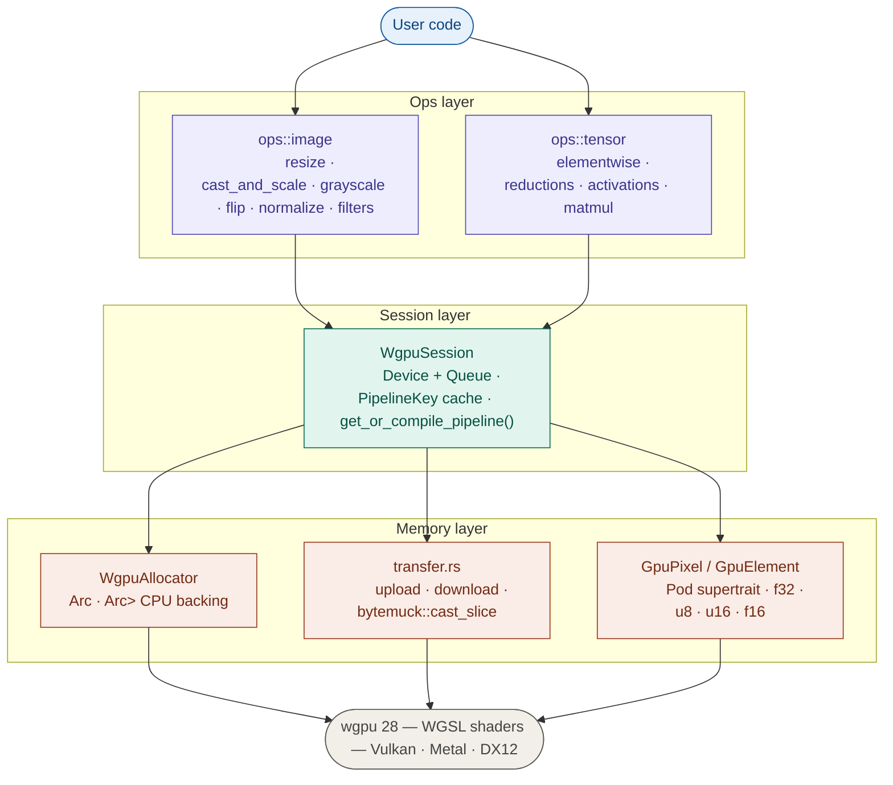

# kornia-wgpu

Hardware-Accelerated Image and Tensor Operations for Kornia-RS via WebGPU.

This crate is a prototype and proposal for Google Summer of Code, aiming to introduce a lightweight, hardware-accelerated backend to the Kornia-RS ecosystem.

For detailed proposal document:
[Google docs proposal](https://docs.google.com/document/d/1f9y_QCpjZI-XzioxuNEmyO0uMCO2iC9Z4pjMTrP8GLY/edit?usp=sharing)

## 📖 Synopsis

Kornia-RS currently relies on CPU-bound operations. `kornia-wgpu` implements `ops::image` and `ops::tensor` modules to enable high-performance spatial image processing and multidimensional tensor math.

Built entirely on safe Rust abstractions, it uses `wgpu` (targeting v28.0.0) to provide a portable GPU compute backend across Vulkan, Metal, DX12, and WebGL. This preserves Kornia-RS's lightweight philosophy by avoiding heavyweight dependencies like CUDA or BLAS.

## ✨ Key Features

* **Cross-Platform GPU Compute:** Runs on Vulkan, Metal, DX12, and WebGL via WGSL shaders.
* **Zero-Copy GPU Chaining:** Execute multiple operations sequentially in VRAM. The GPU reads its own outputs as the next operation's inputs without any PCIe transfers between ops.
* **Real-Time Video Processing:** Grab live frames from cameras or RTSP streams via `kornia-io`, process them on the GPU, and stream results — all without leaving Rust. Benchmarked at 20-25× faster than CPU for resize operations on an RTX 4060.
* **Dynamic Pipeline Caching:** `WgpuSession` owns the device and queue, and caches compiled WGSL pipelines. Each `(op, type)` pair is compiled exactly once, avoiding expensive shader compilations during hot loops.
* **Unconditionally Safe Data Transfers:** Uses `bytemuck` and a `Pod` supertrait to mathematically guarantee there are no padding bytes, making CPU ↔ GPU byte reinterpretations completely safe.
* **Native-feel u8 Support:** The `cast_and_scale` GPU kernel uploads raw u8 frames directly and divides by 255 in the shader — eliminating the CPU cast bottleneck that would otherwise cost ~18ms per 720p frame.

## 🏗️ Architecture

The architecture enforces strict boundaries between CPU System RAM and GPU VRAM. Tensors and Images remain CPU-resident by default; GPU execution requires explicit boundary crossings.



---

# 🚀 Examples

The following examples demonstrate how to construct pipelines that maximize GPU utilization by chaining operations in VRAM.

---

## 1. Initialization

All workflows begin by initializing a shared `WgpuSession`.

```rust
use kornia_wgpu::session::WgpuSession;

// WgpuSession owns the wgpu Device + Queue and the pipeline cache.
// Create once and pass by reference to every op.
let session = pollster::block_on(WgpuSession::new())?;
```

---

## 2. Image Processing Pipeline

Downsample to a thumbnail (nearest), then to a precise model input size (bilinear). The two GPU ops are chained without any CPU round-trip between them.

```rust
use kornia_image::{allocator::CpuAllocator, Image, ImageSize};
use kornia_wgpu::ops::image::resize::{resize_bilinear_f32, resize_nearest_f32};
use kornia_wgpu::transfer::{image_to_cpu, image_to_gpu};

let gpu_src = image_to_gpu(&session, &cpu_src)?;

// Op 1 → Op 2: chained entirely in VRAM, zero PCIe between them
let gpu_thumb    = resize_nearest_f32(&session, &gpu_src,   ImageSize { width: 4, height: 4 })?;
let gpu_model_in = resize_bilinear_f32(&session, &gpu_thumb, ImageSize { width: 3, height: 3 })?;

let _ = session.raw_device().poll(wgpu::PollType::wait_indefinitely());
let cpu_result = image_to_cpu(&session, &gpu_model_in)?;
```

---

## 3. Tensor Math & Large Workloads

Element-wise add two feature maps, then apply ReLU. The add output stays in VRAM and feeds directly into relu — no download between ops.

```rust
use kornia_tensor::{CpuAllocator, Tensor};
use kornia_wgpu::ops::tensor::elementwise::{add, relu};

let gpu_a = session.upload_tensor(&cpu_a)?;
let gpu_b = session.upload_tensor(&cpu_b)?;

let gpu_sum  = add(&session, &gpu_a, &gpu_b)?;   // stays in VRAM
let gpu_relu = relu(&session, &gpu_sum)?;          // reads VRAM output of add

let _ = session.raw_device().poll(wgpu::PollType::wait_indefinitely());
let result = session.download_tensor(&gpu_relu)?;
```

---

## 4. Real-Time Video Pipeline

Grab live 720p frames from an RTSP stream, upscale to 1080p on the GPU using bilinear resize. Each frame crosses the PCIe bus exactly once on upload — the cast from u8 to f32 and the resize both happen in VRAM.

```
RTSP H.265 frame (u8)
  → cast_u8_to_f32_gpu   uploads u8, divides by 255 in shader  (PCIe crossing #1)
  → resize_bilinear_f32  1280×720 → 1920×1080                  (VRAM only)
  → image_to_cpu                                                (PCIe crossing #2)
```

```rust
use kornia_io::gstreamer::StreamCapture;
use kornia_wgpu::ops::image::cast::cast_u8_to_f32_gpu;
use kornia_wgpu::ops::image::resize::resize_bilinear_f32;
use kornia_wgpu::transfer::image_to_cpu;

let pipeline_desc = format!(
    "rtspsrc location={url} latency=0 ! rtph265depay ! avdec_h265 ! \
     videoconvert ! video/x-raw,format=RGB ! appsink name=sink"
);
let mut capture = StreamCapture::new(&pipeline_desc)?;
capture.start()?;

let out_size = ImageSize { width: 1920, height: 1080 };

loop {
    let Some(frame) = capture.grab_rgb8()? else { continue; };

    // u8 bytes go straight to GPU — no intermediate Vec<f32> on the CPU
    let gpu_f32  = cast_u8_to_f32_gpu(&session, &frame)?;
    let gpu_1080 = resize_bilinear_f32(&session, &gpu_f32, out_size)?;

    session.raw_device().poll(wgpu::PollType::wait_indefinitely());
    let result = image_to_cpu(&session, &gpu_1080)?;
}
```

Run the full example with:

```bash
cargo run --example video_pipeline --features gstreamer -- <rtsp-url>
```

---

# 🗺️ Roadmap (GSoC Deliverables)

## Core Infrastructure

- `WgpuSession` — device, queue, pipeline cache
- `WgpuAllocator` — GPU buffer + CPU backing, safe integration with `TensorStorage`
- `PipelineKey` cache — compile each shader exactly once
- `bytemuck` data transfers — Pod-guaranteed safe byte casts at every CPU↔GPU boundary

## Image Operations (`ops::image`)

- Cast and scale: `cast_u8_to_f32` (GPU kernel, eliminates CPU cast bottleneck)
- Resize: nearest-neighbour, bilinear (1-channel and multi-channel)
- Grayscale
- Flip
- Normalize
- Filters: box, Gaussian, Sobel

## Tensor Operations (`ops::tensor`)

- Elementwise math: `add`, `sub`, `mul`, `div`
- Activations: `relu`, `exp`, `log`, `abs`
- Tensor reductions: `sum`, `mean`, `min`, `max`

## Stretch Goals / Future Work

- Batched matrix multiplication
- Perspective warp / homography (for bird's-eye view on Jetson Orin via Bubbaloop)
- Texture-based image pipelines

---

Authored by Neelabhro Ghosh ([@Nyx128](https://github.com/Nyx128)) 🦀