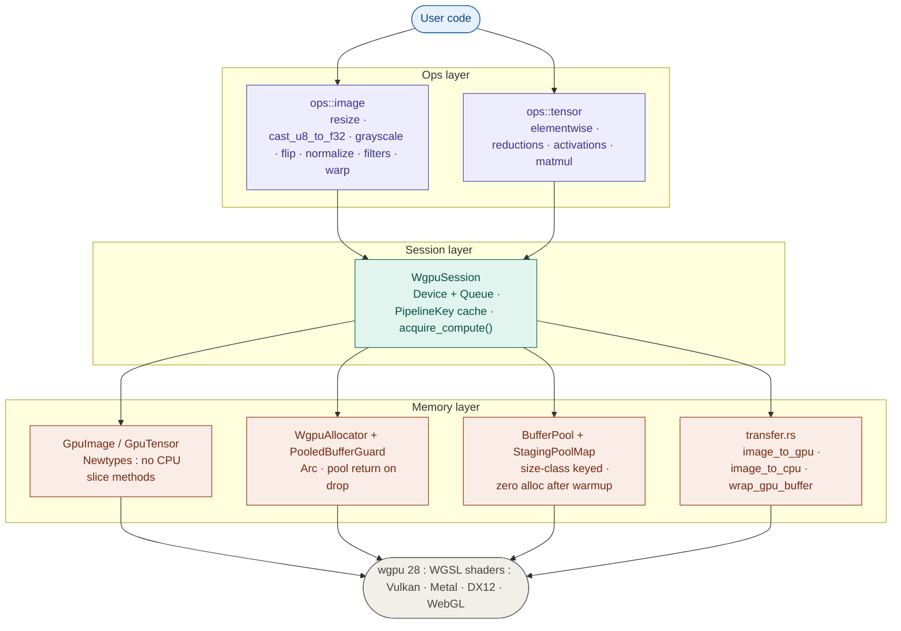

# kornia-wgpu

Hardware-accelerated image and tensor operations for Kornia-RS via WebGPU.

This crate is a prototype and GSoC proposal for introducing a lightweight, portable GPU compute backend to the Kornia-RS ecosystem.

[Google Docs proposal](https://docs.google.com/document/d/1f9y_QCpjZI-XzioxuNEmyO0uMCO2iC9Z4pjMTrP8GLY/edit?usp=sharing)

#### For the maintainers: feel free to comment any suggestions and improvements, in case there are some inconsistencies.

---

## Synopsis

Kornia-RS currently relies on CPU-bound operations. `kornia-wgpu` implements `ops::image` and `ops::tensor` modules to enable high-performance spatial image processing and multidimensional tensor math.

Built entirely on safe Rust abstractions, it uses `wgpu` (v28.0.0) to provide a portable GPU compute backend across Vulkan, Metal, DX12, and WebGL : preserving Kornia-RS's lightweight philosophy by avoiding heavyweight dependencies like CUDA or BLAS.

---

## Why wgpu?

### wgpu over CubeCL

`wgpu` targets Vulkan, Metal, DX12, and WebGL from a single codebase, while CubeCL primarily targets CUDA and ROCm : introducing a hard CUDA dependency that contradicts kornia-rs's lightweight philosophy. CubeCL is also still in early development with a frequently changing API and sparse documentation, making it a poor foundation for a stable library. `wgpu` is mature, well-documented, and requires no external toolchain beyond the GPU drivers already present on the target platform.

Additionally, wgpu exposes texture bindings and hardware sampler units (TMUs), enabling operations like resize, perspective warp, and separable filters to delegate interpolation entirely to dedicated fixed-function hardware. CubeCL has no equivalent : all sampling must be implemented manually in shader arithmetic on storage buffers.

CubeCL kernels are also launched via `unsafe` functions with no compile-time verification of argument types or vectorisation factors : mismatches produce runtime panics or silent incorrect results. kornia-wgpu confines all `unsafe` to a single auditable call in `transfer.rs`, with kernel arguments enforced at compile time via `GpuImage<T, C>` and `GpuTensor<T, N>` newtypes.

### wgpu over raw CUDA

A raw CUDA backend via `cudarc` was considered and rejected for three reasons. First, it reintroduces a hard CUDA dependency and requires `nvcc` at build time : contradicting kornia-rs's zero-external-toolchain philosophy. Second, it only runs on NVIDIA hardware, breaking on AMD, Apple Silicon, Raspberry Pi, and in CI environments without a GPU. Third, wgpu's Vulkan backend on NVIDIA hardware with hand-written WGSL and hardware texture sampling achieves comparable throughput while remaining fully portable.

The same codebase that runs at 30 fps on a Jetson Orin (Vulkan) also runs unchanged on a developer's MacBook (Metal), in a browser (WebGL), and in CI without any GPU (llvm_pipe). A CUDA backend cannot do any of those.

---

## Key Features

**Cross-platform GPU compute.** Runs on Vulkan, Metal, DX12, and WebGL via WGSL shaders with no platform-specific code.

**Zero-copy GPU chaining.** Execute multiple operations sequentially in VRAM. The GPU reads its own outputs as the next operation's inputs without any PCIe transfers between ops.

**Real-time video processing.** Grab live frames from cameras or RTSP streams via `kornia-io`, process them on the GPU, and stream results : all without leaving Rust.

**Dynamic pipeline caching.** `WgpuSession` owns the device and queue and caches compiled WGSL pipelines. Each `(op, type)` pair is compiled exactly once, avoiding expensive shader compilations during hot loops.

**Pool-based memory management.** All GPU buffers : compute outputs and staging readback buffers : come from pre-allocated, size-class-keyed pools. After the first frame, zero allocations occur per frame for fixed-size workloads. Pool return is automatic on drop via `PooledBufferGuard` : no manual `acquire()`/`release()` calls, and no risk of pool exhaustion from buffers held across async cancel points.

**Compile-time GPU/CPU boundary enforcement.** `GpuImage<T, C>` and `GpuTensor<T, N>` are newtypes that expose no CPU slice methods. Calling `.as_slice()` on a GPU resource is a compiler error, not a runtime panic. The only way to read GPU data is `image_to_cpu` or `download_tensor`.

**Unconditionally safe data transfers.** Uses `bytemuck` and a `GpuPixel` supertrait to guarantee there are no padding bytes, making CPU ↔ GPU byte reinterpretations completely safe. The `Pod` bound is enforced at compile time : if a type has padding, it won't compile. There is exactly one `unsafe` block in the entire crate, in `transfer.rs`, which is locally auditable.

**Native u8 support.** The `cast_u8_to_f32_gpu` kernel uploads raw u8 frames directly and packs 4 bytes per u32 to work around WGSL's lack of native u8 storage, dividing by 255 in the shader : eliminating the CPU cast bottleneck entirely.

**Hardware texture sampling (planned).** Where operations involve spatially-local sampling : resize, perspective warp, and separable filters : the implementation will use wgpu texture bindings rather than storage buffers, delegating bilinear interpolation and boundary handling to dedicated hardware texture units (TMUs). This typically yields a 3–5× improvement over storage buffer shaders and is the primary planned optimisation beyond the current prototype. CubeCL has no equivalent capability.

**Runs in CI without a GPU.** wgpu's `llvm_pipe` software backend provides a production-grade CPU execution path : the same WGSL shaders run unchanged, with no mocking or test-only codepaths. Correctness tests, pool lifecycle tests, and buffer round-trip tests all pass on a standard GitHub Actions runner with no GPU present. Performance benchmarks require a real GPU; `llvm_pipe` is not representative of hardware throughput.

---

## Architecture



### Memory design

Every GPU buffer is acquired from a pool and automatically returned when the `GpuImage` or `GpuTensor` holding it is dropped. The return path is:

```
GpuImage drops
  → WgpuAllocator drops
  → Arc<PooledBufferGuard> hits zero
  → PooledBufferGuard::drop fires
  → BufferPool::release(buffer)      ← ready for the next op
```

`GpuImage` and `GpuTensor` are newtypes that expose only dimensional metadata. The inner `Image<T, C, WgpuAllocator>` and `Tensor<T, N, WgpuAllocator>` types are `pub(crate)` : external callers can never reach `.as_slice()` on a GPU-backed resource.

### Safety design

The entire crate is built on three guarantees:

1. **No accidental CPU access.** `GpuImage<T, C>` and `GpuTensor<T, N>` expose no `.as_slice()`. The compiler rejects it at the call site. There is no runtime check : it is structurally impossible.

2. **No unsafe byte reinterpretation.** All CPU↔GPU transfers go through `bytemuck::cast_slice` and `bytemuck::bytes_of`, which are fully safe functions. The `Pod` supertrait on `GpuPixel` is a compile-time proof that a type has no padding and every bit pattern is valid. If a type has implicit padding, deriving `Pod` fails at build time : the bug is caught before it can send garbage bytes to the shader.

3. **One auditable unsafe block.** `transfer.rs` contains a single `unsafe { from_raw_parts(...) }` call. Every other boundary crossing is safe Rust.

### Dispatch design

The 65535 per-dimension hardware limit on workgroup dispatch is handled automatically. For 2D image ops, a 2D workgroup grid is used. For 1D tensor ops over large flat buffers, the dispatch spills into Y when the X dimension would overflow. This is computed at runtime from the tensor size and workgroup geometry : the op author never thinks about it.

`var<immediate>` (push constants) is used to pass scalar parameters like image dimensions directly to shaders without allocating a uniform buffer. On platforms that don't support push constants, the implementation transparently falls back to small uniform buffers.

---

## Examples

### 1. Initialisation

All workflows begin by creating a shared `WgpuSession`.

```rust
use kornia_wgpu::session::WgpuSession;

let session = pollster::block_on(WgpuSession::new())?;
```

---

### 2. Image processing pipeline

Upload once, chain ops in VRAM, download once.

```rust
use kornia_image::{allocator::CpuAllocator, Image, ImageSize};
use kornia_wgpu::{
    ops::image::resize::{resize_bilinear_f32, resize_nearest_f32},
    transfer::{image_to_cpu, image_to_gpu},
};

let gpu_src = image_to_gpu(&session, &cpu_src)?;

// Both ops run entirely in VRAM : zero PCIe transfers between them
let gpu_thumb    = resize_nearest_f32(&session, &gpu_src,   ImageSize { width: 4, height: 4 })?;
let gpu_model_in = resize_bilinear_f32(&session, &gpu_thumb, ImageSize { width: 3, height: 3 })?;

session.raw_device().poll(wgpu::PollType::wait_indefinitely());
let cpu_result = image_to_cpu(&session, &gpu_model_in)?;
```

`gpu_src`, `gpu_thumb`, and `gpu_model_in` are all `GpuImage<f32, 1>`. There is no `.as_slice()` on these types : calling it is a compile error.

---

### 3. Tensor math

Upload, chain ops in VRAM, download.

```rust
use kornia_tensor::{CpuAllocator, Tensor};
use kornia_wgpu::ops::tensor::elementwise::{add, relu};

let gpu_a = session.upload_tensor(&cpu_a)?;
let gpu_b = session.upload_tensor(&cpu_b)?;

// add result stays in VRAM : relu reads it directly
let gpu_sum  = add(&session, &gpu_a, &gpu_b)?;
let gpu_relu = relu(&session, &gpu_sum)?;

session.raw_device().poll(wgpu::PollType::wait_indefinitely());
let result = session.download_tensor(&gpu_relu)?;
```

---

### 4. Real-time video pipeline

Grab live 720p H.265 frames from RTSP, upscale to 1080p on the GPU.

```
u8 frame from GStreamer
  → cast_u8_to_f32_gpu   packs bytes into u32, divides by 255 in shader   (PCIe upload)
  → resize_bilinear_f32  1280×720 → 1920×1080                              (VRAM only)
  → image_to_cpu                                                            (PCIe download)
```

```rust
use kornia_io::gstreamer::StreamCapture;
use kornia_wgpu::{
    ops::image::{cast::cast_u8_to_f32_gpu, resize::resize_bilinear_f32},
    transfer::image_to_cpu,
};

let mut capture = StreamCapture::new(&pipeline_desc)?;
capture.start()?;

let out_size = ImageSize { width: 1920, height: 1080 };

loop {
    let Some(frame) = capture.grab_rgb8()? else { continue; };

    let gpu_f32  = cast_u8_to_f32_gpu(&session, &frame)?;
    let gpu_1080 = resize_bilinear_f32(&session, &gpu_f32, out_size)?;

    session.raw_device().poll(wgpu::PollType::wait_indefinitely());
    let _cpu_out = image_to_cpu(&session, &gpu_1080)?;
}
```

After the first frame, both the compute buffer (VRAM) and the staging buffer (MAP_READ) are recycled from the pool : zero allocations per frame.

```bash
cargo run --example video_pipeline --features gstreamer -- <rtsp-url>
```

A double-buffered async pipeline will be explored for the video node, overlapping PCIe upload of frame N+1 with GPU compute of frame N using `map_async` and a buffer ring drawn from the existing pool. This targets sustained throughput rather than single-frame latency.

---

## Benchmarks

All measurements on RTX 4060 Laptop GPU. "GPU compute only" excludes PCIe transfer time. CPU: AMD Ryzen 7 8845HS (Zen 4, AVX2 : not a weak baseline).

| Operation | GPU compute only | CPU (kornia native) | Speedup |
|-----------|-----------------|---------------------|---------|
| bilinear resize 1ch 2160p→1080p | 272 µs | 6.46 ms | ~24× |
| bilinear resize 3ch 2160p→1080p | 632 µs | 9.74 ms | ~15× |
| bilinear resize 3ch 720p→1080p | 244 µs | 9.23 ms | ~38× |
| add [1024×1024] | 80 µs | 176 µs | ~2.2× |
| add 64× [1024×1024] sequential | 11.2 ms | 29.1 ms | ~2.6× |
| add flat [64×1024×1024] | 3.67 ms | 40.0 ms | ~10.9× |
| relu flat [64×1024×1024] | 2.55 ms | 29.8 ms | ~11.7× |
| add→relu chained flat [64×1024×1024] | 5.23 ms | 39.4 ms | ~7.5× |
| bilinear resize 3ch 2160p→1080p *(texture sampler, planned)* | ~100–200 µs est. | 9.74 ms | ~50–100× est. |

The 8845HS has a fast Zen 4 CPU with AVX2 SIMD : these are not weak baseline numbers. GPU advantage is most pronounced for large, memory-bandwidth-bound workloads and grows significantly with problem size. The sequential batched ops (~2.2–2.6×) expose kernel launch overhead from 64 separate dispatches with synchronisation between them. The flat batched ops (10–12×) show the real throughput advantage when the GPU's parallelism is fully utilised in a single dispatch.

> Texture sampler resize is a planned optimisation. Hardware bilinear units handle interpolation natively, typically yielding a 3–5× improvement over the current storage buffer shader for the same workload.

---

## vs CubeCL benchmarks

An equivalent bilinear resize was implemented in CubeCL (`WgpuRuntime`) using 16×16 workgroups and vec4 vectorisation : the maximum optimisation possible within CubeCL's API. Both implementations run on the same hardware via the same wgpu/Vulkan stack. This is a fair apples-to-apples comparison of hand-written WGSL vs CubeCL's generated WGSL : same GPU, same driver, same backend.

| Operation | kornia-wgpu | CubeCL (optimised) | speedup | tex. sampler (planned) |
|---|---|---|---|---|
| bilinear 1ch 2160p→1080p | **272 µs** | 703 µs | ~2.6× | ~100 µs est. |
| bilinear 3ch 2160p→1080p | **632 µs** | 1113 µs | ~1.8× | ~200 µs est. |
| bilinear 3ch 720p→1080p | **244 µs** | 801 µs | ~3.3× | ~100 µs est. |

> GPU compute only, no PCIe transfer. RTX 4060 Laptop GPU. The CubeCL implementation uses 16×16 workgroups and vec4 vectorisation : the maximum optimisation possible within CubeCL's API. The remaining 1.8–3.3× gap is structural: CubeCL's JIT IR layer adds dispatch overhead that cannot be eliminated, and its compute-only model has no access to hardware texture units (TMUs). Texture sampler resize (planned for kornia-wgpu) is expected to widen this gap further.

For elementwise ops like relu the gap narrows to ~1.3× (kornia-wgpu: 2.55 ms vs CubeCL: 3.40 ms at 64×1024×1024) since neither implementation has a spatial sampling advantage. The remaining difference is purely CubeCL's fixed JIT dispatch overhead. This confirms the gap is workload-dependent : largest where spatial sampling is involved, smallest for pure elementwise ops.

---

## Roadmap (GSoC deliverables)

### Core infrastructure (already implemented)
- `WgpuSession` : device, queue, pipeline cache
- `WgpuAllocator` + `PooledBufferGuard` : pool-backed GPU buffer lifecycle, automatic return on drop
- `BufferPool` + `StagingPoolMap` : size-class keyed buffer pools, zero alloc after warmup
- `GpuImage` / `GpuTensor` newtypes : compile-time GPU/CPU boundary enforcement
- `PipelineKey` cache : each shader compiled exactly once, O(1) lookup thereafter
- `bytemuck` transfers: Pod-guaranteed safe byte casts at every CPU↔GPU boundary

### Image operations (`ops::image`)
- Cast and scale: `cast_u8_to_f32_gpu`  : GPU kernel, eliminates CPU cast bottleneck, bit-packs u8 into u32 to work around WGSL's lack of native u8 storage
- Resize: nearest-neighbour , bilinear  (single and multi-channel)
- Grayscale
- Flip
- Normalize
- Filters: box, Gaussian, Sobel : separable filters will use shared memory tiling to avoid redundant global memory fetches
- `perspective_warp_gpu` : homography warp kernel contributed to `ops::image::warp`; key deliverable for the Bubbaloop bird's-eye view demo

### Tensor operations (`ops::tensor`)
- Elementwise math: `add` , `sub` , `mul` , `div`  : vec4 vectorised
- Activations: `relu` , `exp` , `log` , `abs`  : vec4 vectorised
- Reductions: `sum`, `mean`, `min`, `max` : two-pass parallel reduction for large tensors
- Stride-aware indexing for non-contiguous tensors (rank-4 NCHW) : fast-path dispatch when `is_contiguous()`, stride-aware WGSL variant otherwise
- Tiled matrix multiplication with `var<workgroup>` shared memory : improves arithmetic intensity, reduces global memory bandwidth

### Stretch goals
- Batched matrix multiplication (Z-dimension parallelism)
- Kernel fusion API: lazy `Expr` tree, WGSL codegen, `session.eval()` for elementwise chains : eliminates intermediate VRAM buffers for chained ops
- Texture-based image pipelines : hardware TMU access for resize, warp, and separable filters

---

## Project Timeline (12 Weeks)

### Community Bonding (May 1 – May 24)

- Discuss API design and architecture with Kornia maintainers
- Finalise integration path between kornia-wgpu and Bubbaloop pipeline node model
- Set up CI for GPU tests (Vulkan backend, then Jetson Orin)
- Review prototype against codebase conventions and incorporate mentor feedback

Deliverable: final architecture document and development roadmap.

Note: I don't have a Jetson Orin myself, but I have similarly capable machines for testing. I will be relying on my mentors to give me feedback on Orin-specific behaviour.

---

### Week 1 : Image Operations

Implement foundational image operations.

Tasks:
- Implement grayscale, flip, normalize WGSL shaders
- Integrate with Kornia image API and write unit tests
- Benchmark GPU vs CPU for each new op

Deliverables: functional foundational image operations with benchmarks.

---

### Weeks 2–3 : Filter Kernels

Tasks:
- Implement box, Gaussian, Sobel filter kernels
- Optimised WGSL with shared memory tiling for separable filters
- Prototype texture sampler pipeline for hardware bilinear sampling
- Criterion benchmarks

Deliverables: working filter kernels, examples for applying filters on real-time video streams, basic image pipeline using hardware texture samplers.

---

### Weeks 4–5 : Perspective Warp + Bubbaloop Node

Tasks:
- Implement `perspective_warp_gpu` kernel (`ops::image::warp`)
- Contribute to kornia-wgpu, write tests against CPU reference
- Implement single-camera Bubbaloop node with GStreamer RTSP input
- Test bird's-eye view transform end-to-end on development hardware
- Coordinate with mentors on node integration

Deliverables: perspective warp kernel, Bubbaloop integration prototyped.

---

### Week 6 : Jetson Orin Integration + Bubbaloop Demo

Tasks:
- Deploy pipeline node on Jetson Orin
- Record demo video of single-camera bird's-eye view at 30 fps
- Benchmark GPU vs CPU per-frame latency for the warp kernel
- Profile warp kernel on Jetson Orin and apply any Vulkan-specific dispatch tuning if needed

Deliverables: functional Bubbaloop node, bird's-eye view demo.

Note: Due to other participants also working on Bubbaloop and its experimental nature, if the demo is not functional before Midterm Evaluation I will keep working on it and make up the time : but the video pipeline will be working by Midterm Evaluation.

---

**Midterm Evaluation**

---

### Weeks 6–7 : Tensor Reductions

Tasks:
- Implement sum, mean, min, max with parallel reduction strategy
- Two-pass reduction for large tensors (local reduce + global reduce)
- Unit tests and Criterion benchmarks

Deliverables: stable tensor compute kernels for reduction ops, GPU tensor test suite.

---

### Weeks 8–9 : Non-Contiguous Tensor Support

Tasks:
- Implement `is_contiguous()` fast-path dispatch in session layer
- Stride-aware WGSL variant for non-contiguous tensors (up to rank-4 NCHW)
- Tests covering transposed and permuted tensor views

Deliverables: functional, performant non-contiguous tensor ops.

Optional: coordinate with kornia-vlm related GSoC contributor to test integration where possible.

---

### Weeks 10–11 : Matrix Multiplication

Tasks:
- Implement tiled matmul kernel using `var<workgroup>` shared memory
- Benchmark moderate matrix sizes

Scope: focus on correctness and reasonable performance; batched matmul if time permits.

Deliverables: functional GPU matmul kernel, benchmark comparisons.

---

### Week 12 : Finalisation

Tasks:
- Handle edge cases in non-contiguous tensors and stride-aware indexing
- Cross-platform testing (Vulkan / Metal / DX12)
- Performance profiling
- Documentation and examples

Deliverables: final documentation, Bubbaloop demo, GSoC report.

Each phase includes continuous benchmarking against CPU implementations to ensure measurable performance improvements.

---

## About Me

**Name:** Neelabhro Ghosh
**University:** Atal Bihari Vajpayee IIITM, Gwalior, India
**Degree:** B.Tech in Mathematics and Scientific Computing (2024–2028)
**Timezone:** Indian Standard Time (UTC+5:30)
**GitHub:** [@Nyx128](https://github.com/Nyx128)

I am an undergraduate student with a focus on high-performance computing, numerical analysis, and GPU programming. I have been actively contributing to the Kornia ecosystem and have a deep interest in bringing hardware-accelerated computer vision to Rust.

### Prior Contributions to Kornia-RS

I am already familiar with Kornia-RS's codebase, performance standards, and review process. I have successfully implemented several high-performance features using Rust, SIMD, and Rayon:

- [PR #654](https://github.com/kornia/kornia-rs/pull/654) : Pyramid Operations Optimization: implemented u8 pyramid operations using SIMD vectorization and Rayon, achieving 300–700% throughput improvement.
- [PR #685](https://github.com/kornia/kornia-rs/pull/685) : Draw Line Performance Improvements: implemented a SIMD-friendly Bresenham line algorithm, reducing algorithmic complexity from O(LT²) to O(LT).
- [PR #711](https://github.com/kornia/kornia-rs/pull/711) : AprilTag Algebra Refactor: refactored homography and Cholesky solvers using algebraic types, yielding a ~10% benchmark performance improvement.

### Relevant GPU and Graphics Experience

Beyond CPU-bound SIMD optimizations, my core technical expertise lies in GPU compute and rendering pipelines:

- **Yald (Rust & wgpu):** I authored a Rust GPU compute dispatch library built on wgpu, specifically targeting the reduction of GPU kernel dispatch boilerplate through a lightweight abstraction layer : directly mirroring the architectural goals of kornia-wgpu.
- **Graphics Programming:** I have built a Deferred Renderer in C++/OpenGL using custom GLSL shaders for real-time dynamic lighting, and I am proficient with low-level GPU APIs including Vulkan, CUDA, and WebGPU.

Between my background in Mathematics and Scientific Computing, my prior PRs optimizing Kornia-RS, and my domain expertise in wgpu compute pipelines, I look forward to delivering this project in the coming summer. I am actively discussing this proposal with Kornia maintainers to ensure alignment with project goals.

---

Authored by Neelabhro Ghosh ([@Nyx128](https://github.com/Nyx128)) ;)