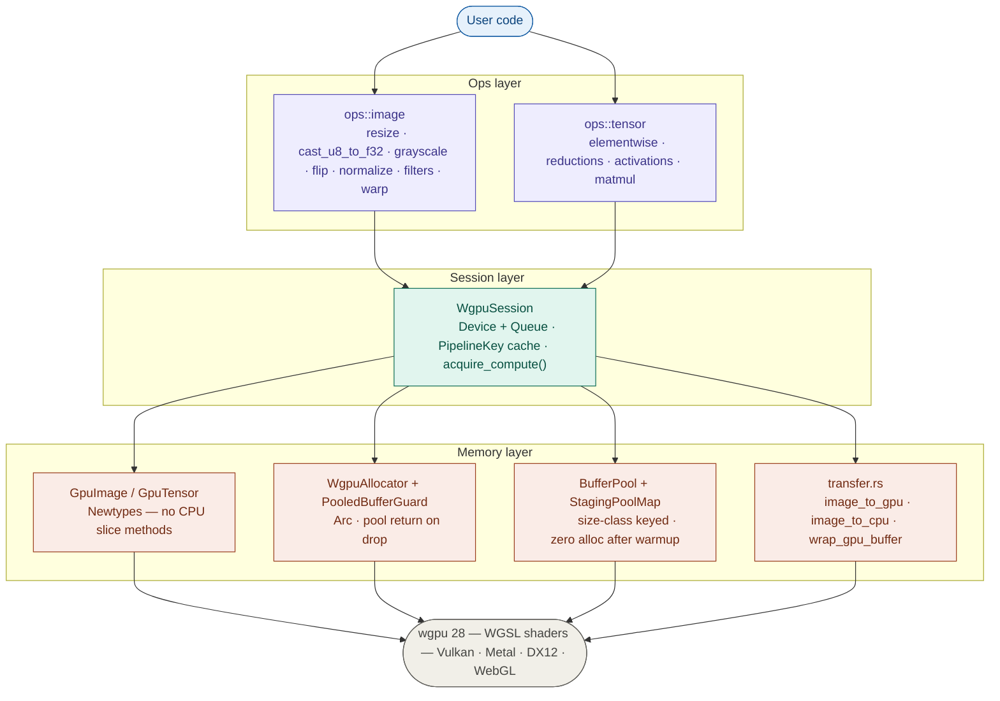

# kornia-wgpu

Hardware-accelerated image and tensor operations for Kornia-RS via WebGPU.

This crate is a prototype and GSoC proposal for introducing a lightweight, portable GPU compute backend to the Kornia-RS ecosystem.

[Google Docs proposal](https://docs.google.com/document/d/1f9y_QCpjZI-XzioxuNEmyO0uMCO2iC9Z4pjMTrP8GLY/edit?usp=sharing)

#### For the maintainers: feel free to comment any suggestions and improvements, in case there are some inconsistencies.
---

## Synopsis

Kornia-RS currently relies on CPU-bound operations. `kornia-wgpu` implements `ops::image` and `ops::tensor` modules to enable high-performance spatial image processing and multidimensional tensor math.

Built entirely on safe Rust abstractions, it uses `wgpu` (v28.0.0) to provide a portable GPU compute backend across Vulkan, Metal, DX12, and WebGL — preserving Kornia-RS's lightweight philosophy by avoiding heavyweight dependencies like CUDA or BLAS.

**Why wgpu over CubeCL?** `wgpu` targets Vulkan, Metal, DX12, and WebGL from a single codebase, while CubeCL primarily targets CUDA and ROCm — introducing a hard CUDA dependency that contradicts kornia-rs's lightweight philosophy. CubeCL is also still in early development with a frequently changing API and sparse documentation, making it a poor foundation for a stable library. `wgpu` is mature, well-documented, and requires no external toolchain beyond the GPU drivers already present on the target platform.

---

## Key features

**Cross-platform GPU compute.** Runs on Vulkan, Metal, DX12, and WebGL via WGSL shaders with no platform-specific code.

**Zero-copy GPU chaining.** Execute multiple operations sequentially in VRAM. The GPU reads its own outputs as the next operation's inputs without any PCIe transfers between ops.

**Real-time video processing.** Grab live frames from cameras or RTSP streams via `kornia-io`, process them on the GPU, and stream results — all without leaving Rust.

**Dynamic pipeline caching.** `WgpuSession` owns the device and queue and caches compiled WGSL pipelines. Each `(op, type)` pair is compiled exactly once, avoiding expensive shader compilations during hot loops.

**Pool-based memory management.** All GPU buffers — compute outputs and staging readback buffers — come from pre-allocated, size-class-keyed pools. After the first frame, zero allocations occur per frame for fixed-size workloads.

**Compile-time GPU/CPU boundary enforcement.** `GpuImage<T, C>` and `GpuTensor<T, N>` are newtypes that expose no CPU slice methods. Calling `.as_slice()` on a GPU resource is a compiler error, not a runtime panic. The only way to read GPU data is `image_to_cpu` or `download_tensor`.

**Unconditionally safe data transfers.** Uses `bytemuck` and a `Pod` supertrait to guarantee there are no padding bytes, making CPU ↔ GPU byte reinterpretations completely safe.

**Native u8 support.** The `cast_u8_to_f32_gpu` kernel uploads raw u8 frames directly and divides by 255 in the shader — eliminating the CPU cast bottleneck.

**Run Anywhere** wgpu's llvm_pipe software backend provides a production-grade CPU execution path — the same WGSL shaders run unchanged, with no mocking or test-only codepaths. Correctness tests, pool lifecycle tests, and buffer round-trip tests all pass on a standard GitHub Actions runner with no GPU present.

Performance benchmarks require a real GPU; llvm_pipe is not representative of hardware throughput as it runs on the CPU.

---

## Architecture



### Memory design

Every GPU buffer is acquired from a pool and automatically returned when the `GpuImage` or `GpuTensor` holding it is dropped. The return path is:

```
GpuImage drops
  → WgpuAllocator drops
  → Arc<PooledBufferGuard> hits zero
  → PooledBufferGuard::drop fires
  → BufferPool::release(buffer)      ← ready for the next op
```

`GpuImage` and `GpuTensor` are newtypes that expose only dimensional metadata. The inner `Image<T, C, WgpuAllocator>` and `Tensor<T, N, WgpuAllocator>` types are `pub(crate)` — external callers can never reach `.as_slice()` on a GPU-backed resource.

---

## Examples

### 1. Initialisation

All workflows begin by creating a shared `WgpuSession`.

```rust
use kornia_wgpu::session::WgpuSession;

let session = pollster::block_on(WgpuSession::new())?;
```

---

### 2. Image processing pipeline

Upload once, chain ops in VRAM, download once.

```rust
use kornia_image::{allocator::CpuAllocator, Image, ImageSize};
use kornia_wgpu::{
    ops::image::resize::{resize_bilinear_f32, resize_nearest_f32},
    transfer::{image_to_cpu, image_to_gpu},
};

let gpu_src = image_to_gpu(&session, &cpu_src)?;

// Both ops run entirely in VRAM — zero PCIe transfers between them
let gpu_thumb    = resize_nearest_f32(&session, &gpu_src,   ImageSize { width: 4, height: 4 })?;
let gpu_model_in = resize_bilinear_f32(&session, &gpu_thumb, ImageSize { width: 3, height: 3 })?;

session.raw_device().poll(wgpu::PollType::wait_indefinitely());
let cpu_result = image_to_cpu(&session, &gpu_model_in)?;
```

`gpu_src`, `gpu_thumb`, and `gpu_model_in` are all `GpuImage<f32, 1>`. There is no `.as_slice()` on these types — calling it is a compile error.

---

### 3. Tensor math

Upload, chain ops in VRAM, download.

```rust
use kornia_tensor::{CpuAllocator, Tensor};
use kornia_wgpu::ops::tensor::elementwise::{add, relu};

let gpu_a = session.upload_tensor(&cpu_a)?;
let gpu_b = session.upload_tensor(&cpu_b)?;

// add result stays in VRAM — relu reads it directly
let gpu_sum  = add(&session, &gpu_a, &gpu_b)?;
let gpu_relu = relu(&session, &gpu_sum)?;

session.raw_device().poll(wgpu::PollType::wait_indefinitely());
let result = session.download_tensor(&gpu_relu)?;
```

---

### 4. Real-time video pipeline

Grab live 720p H.265 frames from RTSP, upscale to 1080p on the GPU.

```
u8 frame from GStreamer
  → cast_u8_to_f32_gpu   packs bytes into u32, divides by 255 in shader   (PCIe upload)
  → resize_bilinear_f32  1280×720 → 1920×1080                              (VRAM only)
  → image_to_cpu                                                            (PCIe download)
```

```rust
use kornia_io::gstreamer::StreamCapture;
use kornia_wgpu::{
    ops::image::{cast::cast_u8_to_f32_gpu, resize::resize_bilinear_f32},
    transfer::image_to_cpu,
};

let mut capture = StreamCapture::new(&pipeline_desc)?;
capture.start()?;

let out_size = ImageSize { width: 1920, height: 1080 };

loop {
    let Some(frame) = capture.grab_rgb8()? else { continue; };

    let gpu_f32  = cast_u8_to_f32_gpu(&session, &frame)?;
    let gpu_1080 = resize_bilinear_f32(&session, &gpu_f32, out_size)?;

    session.raw_device().poll(wgpu::PollType::wait_indefinitely());
    let _cpu_out = image_to_cpu(&session, &gpu_1080)?;
}
```

After the first frame, both the compute buffer (VRAM) and the staging buffer (MAP_READ) are recycled from the pool — zero allocations per frame.

```bash
cargo run --example video_pipeline --features gstreamer -- <rtsp-url>
```

A double-buffered async pipeline will be explored for the video node, overlapping PCIe upload of frame N+1 with GPU compute of frame N using map_async and a buffer ring drawn from the existing pool. This targets sustained throughput rather than single-frame latency.

## Benchmarks

All measurements on RTX 4060 Laptop GPU. "GPU compute only" excludes PCIe transfer time. CPU: AMD Ryzen 7 8845HS

| Operation | GPU compute only | CPU (kornia native) | Speedup |
|-----------|-----------------|---------------------|---------|
| bilinear resize 1ch 2160p→1080p | 272 µs | 6.46 ms | ~24× |
| bilinear resize 3ch 2160p→1080p | 632 µs | 9.74 ms | ~15× |
| bilinear resize 3ch 720p→1080p | 244 µs | 9.23 ms | ~38× |
| add [1024×1024] | 80 µs | 176 µs | ~2.2× |
| add 64× [1024×1024] sequential | 11.2 ms | 29.1 ms | ~2.6× |
| add flat [64×1024×1024] | 3.67 ms | 40.0 ms | ~10.9× |
| relu flat [64×1024×1024] | 2.55 ms | 29.8 ms | ~11.7× |
| add→relu chained flat [64×1024×1024] | 5.23 ms | 39.4 ms | ~7.5× |
| bilinear resize 3ch 2160p→1080p *(texture sampler, planned)* | ~100–200 µs est. | 9.74 ms | ~50–100× est. |

> Texture sampler resize is a planned optimisation. Hardware bilinear units handle interpolation natively, typically yielding a 3–5× improvement over the current storage buffer shader for the same workload.

> Where operations involve spatially-local sampling — resize, perspective warp, and separable filters — the implementation will use wgpu texture bindings rather than storage buffers, delegating bilinear interpolation and boundary handling to dedicated hardware texture units. This is the primary planned optimisation beyond the current prototype.

## vs cubecl benchmarks

| Operation | kornia-wgpu | CubeCL (16×16) | speedup | tex. sampler (planned) |
|---|---|---|---|---|
| bilinear 1ch 2160p→1080p | **272 µs** | 703 µs | ~2.6× | ~100 µs est. |
| bilinear 3ch 2160p→1080p | **632 µs** | 1113 µs | ~1.8× | ~200 µs est. |
| bilinear 3ch 720p→1080p | **244 µs** | 801 µs | ~3.3× | ~100 µs est. |

> GPU compute only, no PCIe transfer. RTX 4060 Laptop GPU. The CubeCL implementation uses 16×16 workgroups and vec4 vectorisation — the maximum optimisation possible within CubeCL's API. The remaining 1.8–3.3× gap is structural: CubeCL's JIT IR layer adds dispatch overhead that cannot be eliminated, and its compute-only model has no access to hardware texture units (TMUs). Texture sampler resize (planned for kornia-wgpu) is expected to widen this gap further.

---

## Roadmap (GSoC deliverables)

### Core infrastructure
- `WgpuSession` — device, queue, pipeline cache
- `WgpuAllocator` + `PooledBufferGuard` — pool-backed GPU buffer lifecycle
- `BufferPool` + `StagingPoolMap` — size-class keyed buffer pools, zero alloc after warmup
- `GpuImage` / `GpuTensor` newtypes — compile-time GPU/CPU boundary enforcement
- `PipelineKey` cache — each shader compiled exactly once
- `bytemuck` transfers — Pod-guaranteed safe byte casts at every CPU↔GPU boundary

### Image operations (`ops::image`)
- Cast and scale: `cast_u8_to_f32_gpu` (GPU kernel, eliminates CPU cast bottleneck)
- Resize: nearest-neighbour, bilinear (single and multi-channel)
- Grayscale
- Flip
- Normalize
- Filters: box, Gaussian, Sobel
- `perspective_warp_gpu` — homography warp kernel contributed to `ops::image::warp`; key deliverable for the Bubbaloop bird's-eye view demo

### Tensor operations (`ops::tensor`)
- Elementwise math: `add`, `sub`, `mul`, `div`
- Activations: `relu`, `exp`, `log`, `abs`
- Reductions: `sum`, `mean`, `min`, `max`
- Stride-aware indexing for non-contiguous tensors (rank-4 NCHW)
- Tiled matrix multiplication with `var<workgroup>` shared memory

### Stretch goals
- Batched matrix multiplication (Z-dimension parallelism)
- Kernel fusion API: lazy `Expr` tree, WGSL codegen, `session.eval()` for elementwise chains
- Texture-based image pipelines

---

Authored by Neelabhro Ghosh ([@Nyx128](https://github.com/Nyx128)) 🦀
